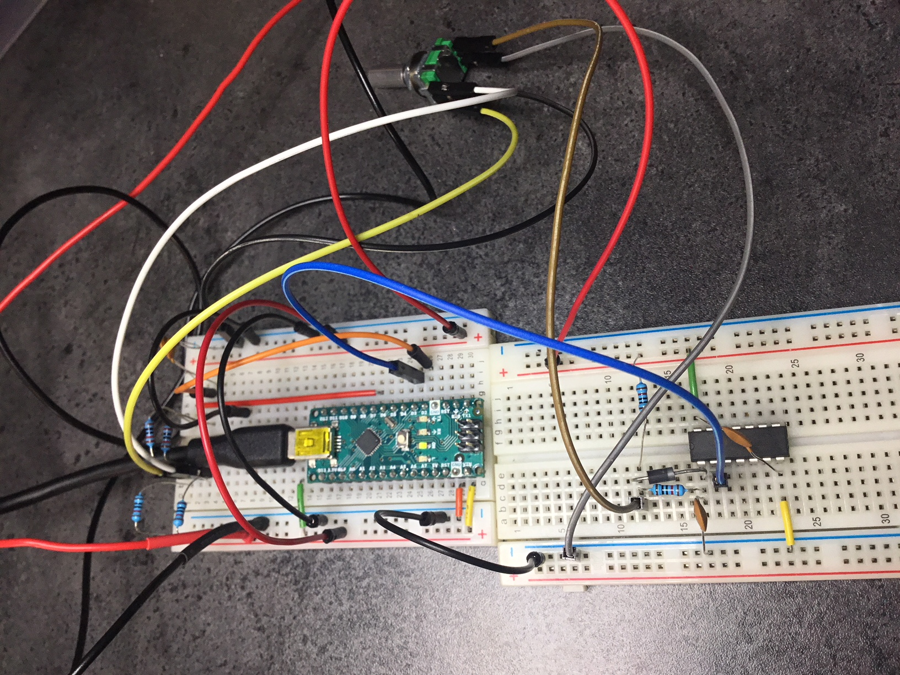

# basics-rotaryencoderswitch

Basics series.

Hardware debouncing of encoder channels and push button.

Software as it stands simply shows a position over a serial connection and a number of button presses. Code for the Encoder class nabbed as is from https://playground.arduino.cc/Main/RotaryEncoders#Intro. In future I may improve on this class by making the update code quicker using direct pin reads. It could also be improved to interrupt of both A and B channels if better resolution was required. See tmp/encoderUse.c for another piece of code I nabbed from the same location as a starting point for these improvements.

Interesting to note the oscillogram which shows a significant delay introduced to remove the hysterisis, almost a millisecond!

The electronics includes circuitry to hook up to the nano and a mountable board to house the rotary encoder.

The assembled test circuit can be seen below:

**Note**: Problem uploading to Nano from PlatformIO. Seems to be a current issue with the newer Nano boards that have the new bootloader. Uploaded using Arduino IDE instead. Issue raised with PlatformIO: https://github.com/platformio/platform-atmelavr/issues/103

# References

## Encoders
https://playground.arduino.cc/Main/RotaryEncoders#Intro
https://www.electroschematics.com/12012/rotary-encoder-arduino/

## Interrupts
https://www.arduino.cc/reference/en/language/functions/external-interrupts/attachinterrupt/

## Debouncing
http://dduino.blogspot.com/2012/03/arduino-button-debouncing.html
https://hackaday.com/2015/12/09/embed-with-elliot-debounce-your-noisy-buttons-part-i/
http://www.labbookpages.co.uk/electronics/debounce.html

